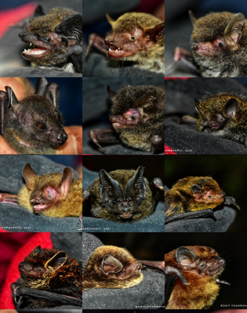
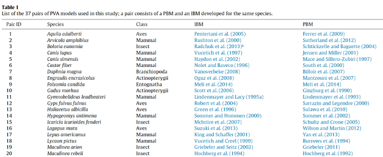
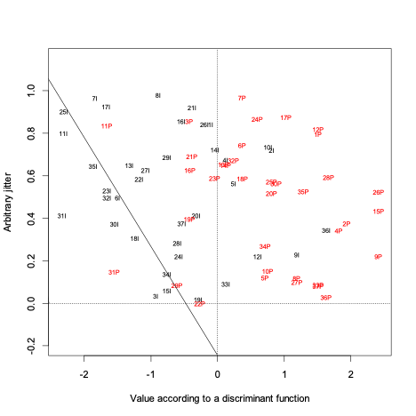
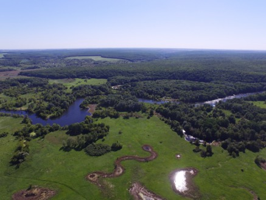
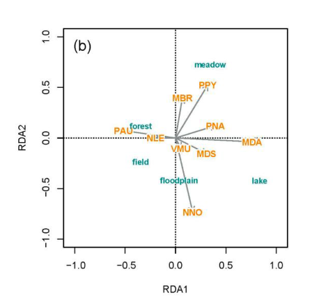
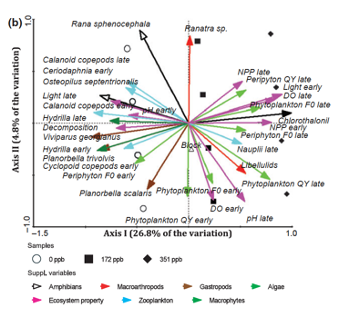
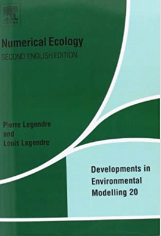
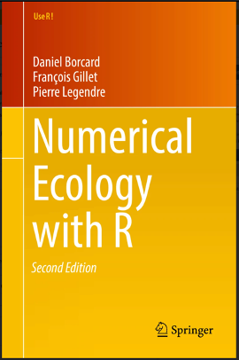

```{r setup, include=FALSE}
knitr::opts_chunk$set(echo = FALSE)
library(plotrix)
library(tidyverse)
library(ggplot2)
```

# Orga / Admin
We meet between 10:00 and 15:00 in two sessions:

- 10:00 - 11:50, - morning session    
- 13:10 - 15:00, - afternoon session.      

The first two days (12th and 13th of April) are in person at the IZW lecture hall.
The third day will take place remotely, via the zoom link shared with you per email.


# Contents of the course

Day 1:    

- General intro to multivariate analyses
- Principal Component Analysis (PCA), data requirements, interpretation
- Redundancy Analysis (RDA)
- Variation partitioning


# Contents of the course   

Day 2:   

- Types of data
- Distance-based vs transformation-based approaches
- Correspondence Analysis (CA) and Canonical Correspondence Analysis (CCA)
- Principal Coordinate Analysis (PCoA)
- Distance-based Redundancy Analysis (db-RDA)

# Contents of the course
Day 3:    

- Non-metric Multidimensional Scaling (NMDS)
- Summary of approaches and data requirements  
- Work on own data


# How multivariate stats differs from the stats you are used to?   

Linear model  

$y = \alpha + \beta\times x + \epsilon$;

$\epsilon \sim N(0, \sigma^2)$

where $\alpha$ is an intercept and $\beta$ is a slope.

```{r linear model, out.width= "50%", out.height= "50%"}
set.seed(5)
npoints <- 20
x <- rnorm(npoints, mean = 0, sd= 2)
y <- 2 + x*3 + rnorm(npoints, 0, 1)
plot(y ~ x, pch = 19, xlab = 'Predictor / Explanatory/',
     ylab = 'Response / dependent', xlim = c(min(x), max(x)))
mtext('independent', side = 1, line = 4)
abline(lm(y ~ x), col = 'blue')
```

# Multiple linear regression
$y = \alpha + \beta_1\times x_1 + \beta_2\times x_2 + ... + \beta_n\times x_n + \epsilon_i$;

$\epsilon_i \sim N(0, \sigma^2)$

where $\beta_n$ are slopes for $n$ predictor variables (denoted as $x_n$).

# An ecological example 

<p style="text-align:center;">

</p>
<p style = "font-size: 40%;">@ Yehor Yatsiuk</p>

We are studying population abundance of _Plecotus auritus_ species in 30 different sites, located across the gradient of the availability in roosting sites and food resources (insects). And we are interested to know how these two predictors affect population abundance of this species. 

__Our response variable__: abundance of _P. auritus_.   
__Our predictors__: roost availability and insect availability.

# Beyond a single response variable
::: {.pull-left}  

<p style="text-align:center;">

</p>
<p style = "font-size: 40%;">@ Rohit Chakravarty</p>
:::


::: {.pull-right}
- What if we wanted to look at how environmental variables affect not only the abundance of a single bat species but of several of them, inhabiting same study sites?   
- Say $p$ is the total number of species across our studied 30 sites. And $p$ = 14.    
- So we now have __$p$ response variables__, each reflecting the abundance of each study species.   
:::

# Difference between multiple regression and multivariate stats
Multiple linear regression:   
we have 30 sites, in each we study abundance of _P. auritus_ using 2 predictors (roost and food availability, $x$ and $v$, respectively).   

$$
\mathbf{Y} =
\begin{bmatrix}
y_1  \\
y_2  \\
y_3  \\
\dots  \\
y_{30}  \\
\end{bmatrix}; 
\mathbf{X} =
\begin{bmatrix}
x_1  & v_1  \\
x_2  & v_2 \\
x_3  & v_3 \\
\vdots  & \vdots \\
x_{30}  & v_{30} \\
\end{bmatrix}
$$

Sites are here shown in rows.

# Difference between multiple regression and multivariate stats
Multivariate stats:    
we have 30 sites, in each we study abundance of $p$ species (14) using 2 predictors (roost and food availability, $x$ and $v$, respectively).   


$$
\mathbf{Y} =
\begin{bmatrix}
y_{1_1} & y_{1_2} & y_{1_3} & \dots y_{1_{14}} \\
y_{2_1} & y_{2_2} & y_{2_3} & \dots y_{2_{14}} \\
y_{3_1} & y_{3_2} & y_{3_3} & \dots y_{3_{14}} \\
\vdots & \vdots & \vdots & \ddots  \\
y_{30_1} & y_{30_2} & y_{30_3} & \dots y_{30_{14}}\\
\end{bmatrix}; 
\mathbf{X} =
\begin{bmatrix}
x_1  & v_1  \\
x_2  & v_2 \\
x_3  & v_3 \\
\vdots  & \vdots \\
x_{30}  & v_{30} \\
\end{bmatrix}
$$

# Multivariate analysis methods  
- Principal Component Analysis (PCA)
- Correspondence Analysis (CA)
- Canonical Correspondence Analysis (CCA)
- Redundancy Analysis (RDA)
- Principal Coordinate Analysis (PCoA)
- <span style = 'color:grey'>Moran’s Eigenvector Maps</span>
- <span style = 'color:grey'>Factor Analysis 
- Discriminant analysis</span>
- NMDS   
- <span style = 'color:grey'>Principal Response Curves</span>   
- <span style = 'color:grey'>k-means clustering</span>   
- ....   

(non-exhaustive list)


# Applicable beyond community data  
Although several multivariate analysis methods (e.g. CA and CCA) were initially developed specifically to analyse community data, they are applicable more broadly.   
When dealing with other types of the data than community data, sites (clearly understood for community data) are also referred to as objects or samples in multivariate analysis.

# Example I: effects of environment on individual bat condition

__Sample__: bat individual   
__Response variables__: temperature, hormone level, parasite load    
__Predictor variables__: habitat structure, food availability, weather descriptors     
So now each object /sample is an individual, and we have measurements per this individual   

# Example I: effects of environment on individual bat condition

Say we sampled for 40 bat individuals their temperature (b), cortisol (c), body mass (m), and parasite load (l). We want to understand how morpho-physiological state of those individuals is affected by 4 predictors (habitat structure - h,  food availability - f, precipitation -p, and temperature -t).   


$$
\mathbf{Y} =
\begin{bmatrix}
b_1 & c_1 & m_1 & l_1 \\
b_2 & c_2 & m_2 & l_2 \\
b_3 & c_3 & m_3 & l_3 \\
\vdots & \vdots & \vdots & \ddots  \\
b_{40} & c_{40} & m_{40} & l_{40}\\
\end{bmatrix}; 
\mathbf{X} =
\begin{bmatrix}
h_1  & f_1 & p_1 & t_1  \\
h_2  & f_2 & p_2 & t_2 \\
h_3  & f_3 & p_3 & t_3 \\
\vdots  & \vdots & \vdots  & \vdots \\
h_{40}  & f_{40} & p_{40} & t_{40} \\
\end{bmatrix}
$$


# Example II: Effect of data availability on the model choice for Population Viability Analysis (PVA)

__Sample__: publication reporting a PVA model       
__Response variables__: studied species, social/territorial organisation of the species, availability of the fine-scale dispersal data, etc.      
__Possible predictor variables__:  Is the used model an individual-based model or a more aggregated model like population matrix model?      


# Effect of data availability on the complexity of PVA model
<p style = "font-size: 80%; ">Radchuk et al. (2016) analysed models developed to assess population viability of 37 species. For each species we found a pair of models: an individual-based and a matrix-model.     
__The aim__:  to understand how data availability and complexity of the species life history and ecology affect the choice of the model complexity.</p>    
<p style="text-align:center;">

</p>


# Impact of data availability on the complexity of PVA model   
::: {.pull-left}  

<p style="text-align:center;">

</p>
<p style = "font-size: 40%;"> unpubl. data Radchuk</p>
:::

::: {.pull-right}  
Discriminant Analysis classifying each model using  the obtained discriminant function. “I” corresponds to individual-based model (in black) and “P” to population-based (e.g. matrix model, in red). Discriminant function assigns models to the left of “0” on abscissa to Is, and those to the right – to Ps. Certain models are misclassified by the function.
:::


# Bat diversity in Eastern Ukraine
::: {.pull-left}  

<p style="text-align:center;">

</p>
<p style = "font-size: 40%;">@ Anton Vlaschenko</p>
:::

::: {.pull-right}  
<p style="text-align:center;">

</p>
Vlaschenko et al. 2022 investigated the impact of land-use types and forest age structure on bat assemblages in Eastern Ukrainian Forests.
:::

# How land use types shape bat communities in Eastern Ukrainian forests
::: {.pull-left}  

<p style="text-align:center;">

</p>
<p style = "font-size: 40%;">@Vlaschenko et al. 2022</p>
:::

::: {.pull-right}  

- <p style="color:orange; font-style:italic";>PPY - Pipistrellus pygmaeus</p>    
- <p style="color:orange; font-style:italic";>PNA - Pipistrellus nathusii</p>        
- <p style="color:orange; font-style:italic";>MDA - Myotis daubentonii</p>    
- <p style="color:orange; font-style:italic";>MBR - Myotis brandtii</p>         
- <p style="color:orange; font-style:italic";>NNO – Nyctalus noctula</p>         
- <p style="color:orange; font-style:italic";>PKU – Pipistrellus kuhlii</p>         
- <p style="color:orange; font-style:italic";>PAU – Plecotus auritus</p>    
- <p style="color:orange; font-style:italic";>VMU – Vespertilio murinus</p>          

:::

# Impact of fungicide on aquatic community

::: {.pull-left}  

<p style="text-align:center;">

</p>
<p style = "font-size: 40%;">@McMahon et al. 2012</p>
:::

::: {.pull-right}   
<p style = 'font-size: 90%;'>
McMahon et al. (2012) investigated the effect of chlorothalonil on the diversity of a 34-species rich multi-trophic community, as well as on the ecosystem functioning delivered by this community.   
Results of distance-based RDA to assess the effect of the fungicide on community and ecosystem functioning. </p>

:::


# Questions?  


# Main sources used throughout this course
::: {.pull-left}  
<p style="text-align:center;">

</p>
:::

::: {.pull-right}  
<p style="text-align:center;">

</p>
:::


