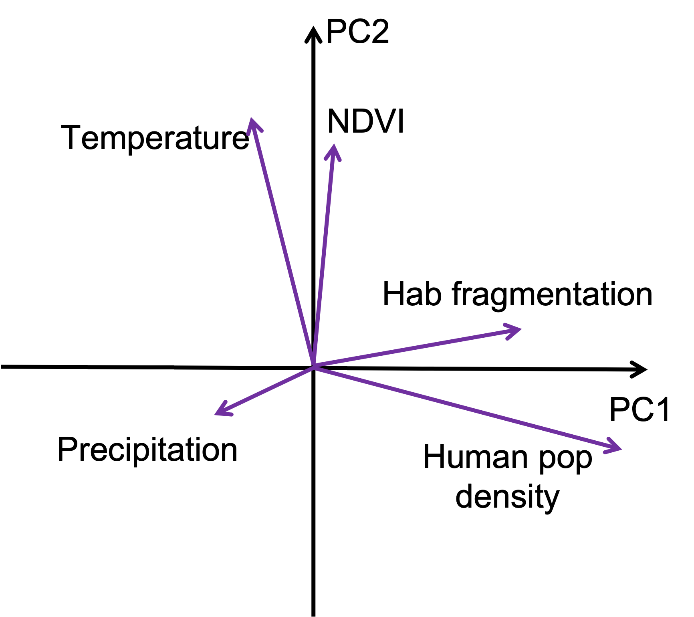
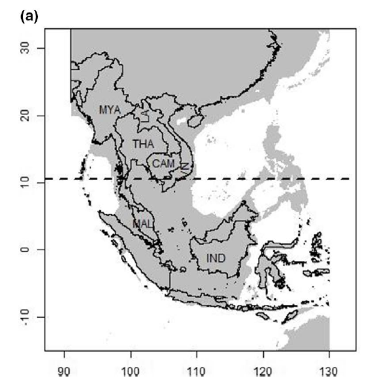
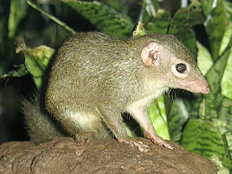

```{r setup, include=FALSE}
knitr::opts_chunk$set(echo = FALSE)
library(vegan)
library(tidyverse)
library(ggplot2)
library(mvtnorm)
```

# What is PCA
- An eigenvector-based method for dimensionality reduction.   
- Works on raw, quantitative data (are expected to have multivariate normal distribution).    
- It preserves Euclidian distances among sites (also known as objects / samples).   
- It is unconstrained ordination method, i.e. an explorative tool (used for descriptive analysis), not a statistical test.   

# Main requirements / assumptions
- Linear relations among variables;     
- Requires quantitative data (values can also be negative);    
- Requires data in same units for all variables. Otherwise, the data has to be standardised;          
- Not suitable for data sets where responses are unimodal, rather than linear. This is often the case with compositional data, where relation with environmental gradient cannot be approximated by linear relation (i.e. data with many zeros).     

# How it works: very simplified
__Objects__: sites, individuals, samples    
__Variables__: (for sites) temperature, precipitation, human population density....   
 Let us have $n$ objects and $p$ variables. Each variable can be thought of as a dimension, since we can look at how samples are located along that variable. So, these $n$ objects can be represented in the $p$-dimensional space.

# Multidimensional space
```{r simple_PCA, fig.align='center', out.height= "50%", out.width='50%'}
set.seed(24)
sigma <- matrix(c(4,2,2,3), ncol=2)
x <- rmvnorm(n=500, mean=c(1,2), sigma=sigma)
plot(x, pch = 19, xlab = 'x', ylab = 'y')
arrows(x0 = 1, y0 = 1.5, x1 = 3.5, y1 = 3.5, col = "violet", lwd = 4)
arrows(x0 = 1, y0 = 1.5, x1 = 0.5, y1 = 2.5, col = "violet", lwd = 4)
text(x = 2.8, y = 1.4, label = 'PC1', col = 'violet', cex = 3)

```
The method finds the direction with the largest variance in the data (this direction is not necessarily aligned with the one of the dimensions, i.e. variables in the data). The direction along which most of the data variance is observed will be extracted as the first axis, also know as the first Principal Component (PC1).

# Proceeds to determine all the principal components
It then extracts the next axis, which is the second most important in variance, given that it is orthogonal (i.e. linearly independent) to the first one. It then goes on like that and extracts all $p$ axes (in the decreasing order of variance observed in the data).   


# Rotates original coordination system
<p style="text-align:center;">

</p>

The method then rotates original data such that x axis becomes our Principal Component 1, y axis - PC2, etc. It also allows to see the relation of the variables to these extracted Principal Components and relations among the variables, in terms of how correlated they are.      

# Behind the scenes
Let us look at 8 objects (think of sites in which we measure biodiversity of plants).   
For simplicity, we look at 3 variables only (though in reality it is of little use to apply PCA to these data).   
<span style ="color:blue"> Why is it not that useful?</span>

```{r examplePCA}
npoints <- 8
Temperature <- c(1, 1.5, 2, 2.1, 8, 9, 8.8, 10)
Sunshine <- c(3, 4, 6, 2, 7, 9.8, 8, 5)
Humidity <- c(rnorm(4, 8, 2), rnorm(4, 10, 3))
df <- data.frame(Temperature, Sunshine, Humidity)
df
```

# Plot data along one variable, i.e. dimension
```{r plotsimple PCA data, fig.align='center', out.height='40%', out.width='40%'}
df$plotY <- rep(0.1, length(Temperature))
plot(plotY ~ Temperature, data = df, pch = 19, ylab = '', xlab = 'Temperature')

```
We see that the sites (and thus their composition - that is what we are interested in) differ a lot depending on the temperature at the site. We detect two groups of sites: one group of sites located in environments with high temperatures, and the second group with lower temperatures.    

# Plot data in 2-dimensional space
```{r continue simple PCA - 2dim, fig.align='center', out.height='50%'}
plot(Sunshine ~ Temperature, data = df, pch = 19)

```

# Add 3rd dimension
```{r continue simple PCA - 3dim, fig.align='center', out.height='50%'}
plot(Sunshine ~ Temperature, data = df, pch = 19, cex = df$Humidity /5)
abline(lm(Sunshine ~ Temperature, data = df), col = 'blue', lwd = 2)


```

# Back to PCA: center raw data
```{r simplePCA-center, echo=TRUE}
mean_x <- mean(Temperature); mean_x
mean_y <- mean(Sunshine); mean_y
dat_center <- df %>% 
  mutate(temp_cent = scale(Temperature, center = TRUE, scale = FALSE),
         Sun_cent = scale(Sunshine, center = TRUE, scale = FALSE))
dat_center

```

# Extract covariance matrix
```{r simplePCA-covMat, echo=TRUE}
mat_centr <- as.matrix(subset(dat_center, select = c('temp_cent', 'Sun_cent')))
covMat <- cov(mat_centr)
covMat
eig <- eigen(covMat)
eig
```

# A little bit more of matrix algebra
```{r simplePCA-eigen, echo = TRUE}
NewDat <- mat_centr %*% eig$vectors
NewDat
```


# Plot rotated data
```{r simplePCA-plotRot, fig.align='center', out.height='60%', out.width='60%'}
plot(NewDat, pch = 19, xlab = 'PC1', ylab = 'PC2')
```
Does this plot look familiar to you?


# What PCA is used for
- exploration of the relations among variables;   
- dimensionality reduction technique, i.e. when we want to describe 10 different variables with 2 or 3 instead (e.g. as predictors in a linear model)


# Application: life history traits of mammals in SE Asia
::: {.pull-left}  
<p style="text-align:center;">

</p>
:::

::: {.pull-right}
Investigating the relations between multiple life history traits of mammals in Southeast Asia. Initially we were interested in 143 mammal species. We extracted life history data from PanTheria database (Jones et al. 2009). Due to the scarcity of the life history data, we ended up with 25 species only.

:::

# Data
```{r LH data read, echo = TRUE}
#  reading in the file with the 143 species of interest
spSEAsia <- read.csv(file = here::here('data', 'Species_SEAsia_02_02_16_fin.csv'))
str(spSEAsia)

# read in the PanTheria database
pant <- read.delim(file = here::here('data', 'Pantheria.txt'))
str(pant)
```

   
```{r data prep}
## joining both datasets together
pant$Sp_bin <- pant$MSW05_Binomial
LH <- merge(pant, spSEAsia, by = "Sp_bin")
nrow(LH)  

## Select 5 life history traits of interest
LH_subs <- LH %>%
  select('Sp_bin', 
         'X5.1_AdultBodyMass_g',  'X15.1_LitterSize',
         'X6.1_DietBreadth', 'X22.1_HomeRange_km2')


# replacing -999 with NA
LH_subs[LH_subs == -999] <-  NA

LH_noNA <- na.omit(LH_subs)
names(LH_noNA) <- sub("^[^_]*_", "", names(LH_noNA))

```
# Species in the dataset

::: {.pull-left}  
<p style="text-align:center;">

</p>
<p style = "font-size: 40%;">@wikipedia: Elephas maximus</p>

<p style="text-align:center;">

</p>
<p style = "font-size: 40%;">@wikipedia: Canis aureus</p>

:::

::: {.pull-right}  
<p style="text-align:center;">

</p>
<p style = "font-size: 40%;">@wikipedia: Tupaia glis</p>

<p style="text-align:center;">

</p>
<p style = "font-size: 40%;">@wikipedia: Tarsius bancanus</p>

:::

# Run PCA
We mainly use library vegan in R for multivariate statistics.    
Function `rda()` is used to run PCA and RDA.
```{r run PCA, echo=TRUE}
str(LH_noNA)
traits_SEas <- LH_noNA %>%
  select(-c('bin'))
pca_SEasia <- rda(traits_SEas, scale = TRUE)

```
Since our variables (Adult body mass, litter size, diet breadth and home range) are in very different units, we use option 'scale=', so that all variables are now unitless and comparable. In other words we are applying PCA on correlation matrix (instead of covariance matrix).

# Interpreting PCA
```{r interpret PCA, echo = TRUE}
summary(pca_SEasia)


```
__Inertia__: term originates from Correspondence Analysis (arguably some of the first multivariate analysis) and means variation in the data. In case of PCA on covariance matrix inertia is a sum of the variances of the variables; in case of PCA on correlation matrix, it is the sum of the diagonal values of the correlation matrix.     
<span style ="color:blue"> What are the values on the diagonal in such a correlation matrix?</span>

# Interpreting PCA
```{r interpret PCA2}
summary(pca_SEasia)


```
__Eigenvalues__: Measure the importance of each principal component, i.e. how much variance it captures. Also shows proportion explained by dividing by the total inertia.   
__Species scores__: coordinates (in the new rotated space) of the arrow heads of the variables. Term 'Species' is a legacy-term and has its name because the first multivariate methods were originally developed for analyses of communities composed of species. So, the term 'Species' is usually used to refer to the response variables (irrespective of what they represent).    
__Site scores__: Coordinates of the sites in the new ordination space. 'Sites' are used to refer to objects, or samples. (here, our species, actually!)    

# Scaling 1 and 2 in PCA
- __Scaling 1__: distance biplot. Eigenvectors are scaled to unit length. __Distances among objects approximate their Euclidian distances in multidimensional space.__ The angles among vectors are meaningless.    
- __Scaling 2__: correlation biplot. Each eigenvector is scaled to the square root of its eigenvalue. __The angles between vectors (variables) reflect their correlations.__ Distances among objects are not approximations of their Euclidian distances in multidimensional space.     
- So: if interested in relationships among objects primarily, choose scaling 1. If interested in the relations among descriptors (i.e. variables), choose scaling 2.


# How many Principal Components to retain?
Usually the researcher looks at the eigenvalues and decides how many axes are worth displaying. PCA is not a statistical test, so the decisions can be based on a (rather arbitrary) choice to display certain percentage of total variance in the data. Say, 75% of the data variance. Then, one displays as many principal components, as needed, to reach a total of 75% of data variance.      

Two other commonly used approaches: __Kaiser-Guttman criterion__ and __a broken stick model__.

# Kaiser-Guttman criterion
Based on the mean of all eigenvalues. The principal components whose eigenvalue is > this mean are used for displaying.    
```{r Kaiser-Guttman, echo = TRUE, out.height='40%', out.width='40%', fig.align='center'}
# extract eigenvalues
eigval <- pca_SEasia$CA$eig
eigval[eigval > mean(eigval)]  
barplot(eigval, las = 2)
abline(h= mean(eigval), col = 'blue', lwd = 2)
```

# A broken-stick model
<p style = 'font-size: 80%;'>This method randomly divides a stick of unit length in the same number of pieces as there are Principal Components. The pieces are then sorted in the decreasing order and compared to the eigenvalues. Only those principal components are chosen to be displayed that are larger than the respective piece of the stick.</p>
```{r broken stick, out.height='40%', out.width='40%', fig.align='center'}
pieces <- length(eigval)
bsm <- data.frame(j = seq(1:pieces), p = 0)
bsm$p[1] <- 1/pieces

for(i in 2:pieces){
  bsm$p[i] <- bsm$p[i-1] + (1/(pieces + 1 - i))
}

bsm$p <- 100*bsm$p/pieces

barplot(t(cbind(100*eigval/sum(eigval), bsm$p[pieces:1])), beside = TRUE, las =  2, col = c('blue', 'lightgrey'))

## available function
bstick(pca_SEasia)
eigval
```


# Visualize PCA results
```{r plot PCA, echo = TRUE,  out.height='60%', out.width='60%', fig.align='center'}

biplot(pca_SEasia, scaling = 'species')
```
<span style = 'color:blue'> Why do we use scaling = 'species'?</span>


# Make your plot nicer
```{r custom-plotPCA, out.height='60%', out.width='60%', fig.align= 'center'}
var_PCA <- scores(pca_SEasia, choices = c(1,2), scaling = 2, tidy = TRUE)

LH_noNA$label <- rownames(LH_noNA)
vis_PCA <- merge(subset(var_PCA, score =='sites'), LH_noNA, by = 'label')

spec <- var_PCA %>% 
  filter(score == 'species')
ggplot(vis_PCA, aes(x = PC1, y = PC2)) +
   geom_text(aes(label = bin), check_overlap = TRUE) +
  geom_segment(data = spec, 
               aes(x=0, y=0, xend=PC1, yend=PC2), 
               arrow = arrow(length=unit(.5, 'cm')),
               col ='red') +
  geom_text(data = spec, aes(label = label), check_overlap = TRUE,
            nudge_y = -0.1, col = 'red') +
theme_bw() 
  
```


# Questions?  

# Check-up
- What are assumptions of PCA?
- Can we conduct PCA if several variables are strongly correlated (i.e. considered a problem of collinearity in GLMMs)?


