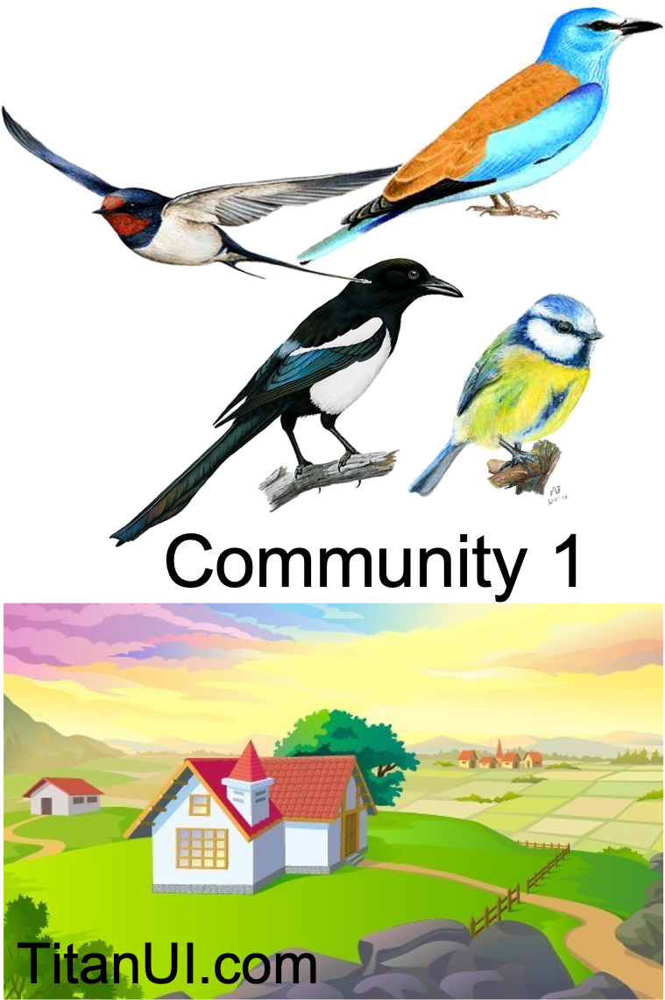
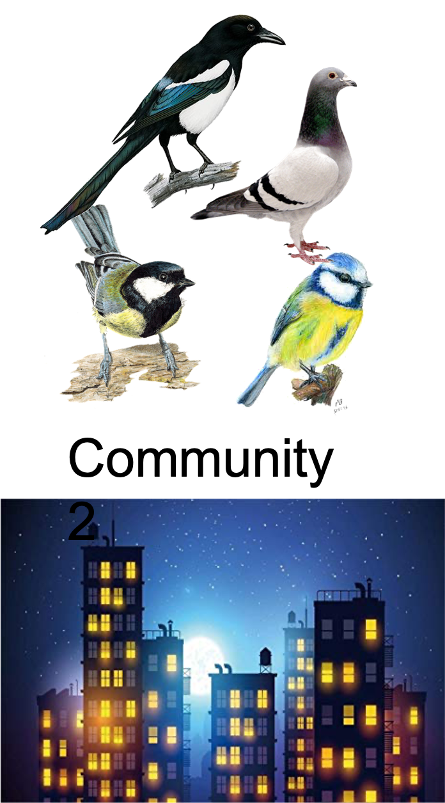

```{r setup, include=FALSE}
knitr::opts_chunk$set(echo = FALSE)
options(rgl.useNULL = TRUE) 
library(vegan)
library(tidyverse)
library(ggplot2)
library(mvtnorm)
library(rgl)
knitr::knit_hooks$set(webgl = hook_webgl)
library(corrplot)
library(seriation)
```

# Recall the data structure
<p style="text-align:center;">

</p>

# Associations
1. Between objects (sites, samples)
2. Between descriptors (explanatory variables and response variables OR among variables)

# Associations between descriptors
```{r Correl, fig.align='center', out.height= "90%", out.width='90%'}
set.seed(240)
sigma <- matrix(c(2.5, 2, 2, 2, 3, 2, 2, 2, 3), ncol=3, byrow = TRUE)
x <- rmvnorm(n=500, mean=c(1,2, 1), sigma=sigma)

demo_cor <- as.data.frame(x)
colnames(demo_cor) <- c('Sunshine', 'Temperature', 'AET')

par(mfrow = c(1, 2))
plot(Sunshine ~ Temperature, data = demo_cor, pch = 19)
abline(lm(Sunshine ~ Temperature, data = demo_cor), col = 'grey', lty = 2, lwd = 3)
corTempSun <- cor.test(demo_cor$Sunshine, demo_cor$Temperature)
text(x = 4, y = -3, labels = paste0('Pearson corr = ', round(corTempSun$estimate, 3)))

plot(Sunshine ~ AET, data = demo_cor, pch = 19)
abline(lm(Sunshine ~ AET, data = demo_cor), col = 'grey', lty = 2, lwd = 3)
corAETSun <- cor.test(demo_cor$Sunshine, demo_cor$AET)
text(x = 4, y = -3, labels = paste0('Pearson corr = ', round(corAETSun$estimate, 3)))

```

# Correlations between descriptors
```{r 3D, out.height='90%', out.width='90%', fig.align='center'}

col.table <- colorRampPalette(c("blue", "green", "yellow", "red"))(11)
plot3d(x= demo_cor$Temperature, y = demo_cor$Sunshine, z = demo_cor$AET, type="p",
        xlab = 'Temperature', ylab = 'Sunshine', zlab = 'AET',
        col=col.table[cut(demo_cor$Temperature, seq(-4, 6, by =1))])
 #legend3d("bottomright", legend=levels(cut(c(-4,6), 10)), col=col.table, pch=20)
 rglwidget()
```
So, each descriptor is one dimension and to investigate associations among them we take correlations or covariances.   


# Association between objects 
Dissimilarity between object pairs: Euclidean distance, Jaccard dissimilarity, Bray-Curtis dissimilarity

::: {.pull-left}  
<p style="text-align:center;">

</p>
:::

::: {.pull-right}  
<p style="text-align:center;">

</p>

:::

How to measure distance between these two sites, that is distances among sites in community composition?  


# Issues with species data 
- Double zeros: absences of species in both sites cannot be interpreted the same way as presences of the species in both sites.   
- Absence can be due to environment being unsuitable, due to detection error (species present but not observed) or non-regular distribution of species across the study sites.       
- But: number of zeros increases as we observe larger number of sites and more species-rich communities (higher number of rare species usually).   
- This also has more technical downside as the distribution of species abundances deviate strongly from normal.          

::: {.pull-left}  
<p style="text-align:center;">

</p>
:::

::: {.pull-right}  
<p style="text-align:center;">

</p>

:::

# Possible ways to deal with this
- First transform species data so as to approximate quantitative data, and then apply multivariate methods used for such quantitative data (e.g. PCA and RDA).   
- Use community dissimilarity metrics that measure how different communities are in their composition (and are suited to species data) and apply respective multivariate methods to those data (e.g. PCoA).          


# Transformation of community data
- __Hellinger transformation__: convert species abundance to relative (divide by total abundance in the site) and then take a square root.     
- __Chord transformation__: Hellinger transformation is applied to squared abundance data. This leads to the site vectors being normalised to 1.   
- __$\chi^2$ transformation__: the relative abundance of the species in the site is used, but it is also adjusted for the square root of matrix total abundances.     
- All available using function `decostand()` from `vegan` and specified via option `method = `.      
Chord is implemented under name `normalize`.

# PCA or RDA on transformed data
After we have transformed the abundance data using one of these transformations, we apply PCA or RDA (depending on whether our goal is unconstrained or constrained ordination). Since we pre-transformed the data, the resulting distances will be not Euclidean but will depend on the transformation we used. And these distances (Hellinger, $\chi^2$) are not sensitive to 'double zeros', circumventing the problem.     


- Hellinger transformation + Euclidean distance (PCA or RDA) --> Hellinger distance     
- $\chi^2$ transformation + Euclidean distance (PCA or RDA) --> $\chi^2$ distance     


# Community (dis)similarity
Jaccard similarity index    

- Presence-absence based (i.e. based on species richness)     
$J = \frac {a} {(a + b + c)}$,       
where a is the number of species that are present in both sites      
b is the number of species that are unique to site 1      
c is the number of species that are unique to site 2       

- a = 2; b = 2, c = 2     
$J = \frac {2} {(2 + 2 + 2)} = 0.33$   
$D_J = 1 - J = 1- 0.33 = 0.66$     


::: {.pull-left}  
<p style="text-align:center;">

</p>
:::

::: {.pull-right}  
<p style="text-align:center;">

</p>

:::

# Bray-Curtis similarity
Considers species abundances.    
$$BC_{ij} = \frac{2 \times C_{ij}}{S_i + S_j}$$

where $C_{ij}$ are the sum of minimum abundances of each species that are found at both sites (i and j);     
$S_i$ is the total abundance of all species found in site $i$;     
$S_j$ is the total abundance of all species found in site $j$.     

Different dissimilarity metrics are available with function `vegdist()` in `vegan` and specified via option `method = `. 


# Application
Bat community in Eastern Ukrainian forests       

```{r Anton data, echo = TRUE}
dat <- read.csv(file = here::here('data', 'PlotLevel_16112021.csv'))

str(dat)
```

# Explore species data
```{r explore_dat, echo = TRUE, out.height= '60%', out.width= '60%', fig.align='center'}
com <- subset(dat, select = c(MDA, MBR, MDS, NNO, NLE, ESE, PNA, PPY, VMU, PLA)) # PKU,  NLA removed
com_long <- pivot_longer(com, cols =everything(), names_to = 'Species',
                         values_to = 'Abundance')
ggplot(com_long, aes(x = Abundance)) +
  geom_histogram(binwidth = 5) +
  facet_wrap(vars(Species), scales = "free") + theme_bw() + 
  theme(strip.background = element_blank())
```

# Transform data
We use Hellinger transformation    
```{r transform, echo = TRUE, out.height= '60%', out.width= '60%', fig.align='center'}
hel_com <- decostand(com, method =  'hellinger')  

hel_com_long <- pivot_longer(hel_com, cols =everything(), names_to = 'Species',
                         values_to = 'Abundance')
ggplot(hel_com_long, aes(x = Abundance)) +
  geom_histogram(binwidth = 0.05) +
  facet_wrap(vars(Species), scales = "free") + theme_bw() + 
  theme(strip.background = element_blank())
```

# Compute distances directly
```{r BrayCurtis, echo = TRUE}
BrayDist <- vegdist(com, method =  'bray')  
BrayDist
```

# Visualise Bray-Curtis dissimilarities
```{r visualize distMat, echo = TRUE, out.height='60%', out.width='60%', fig.align= 'center'}
dissplot(BrayDist)
```


# Another way to visualize
```{r visualize cor, echo = TRUE, out.height='70%', out.width='70%', fig.align= 'center'}
corrplot(as.matrix(BrayDist), method = 'shade')
```

# Length of the gradient
- If environmental gradient that was sampled is rather short, the relation between species abundance and environment can be approximated as linear --> use linear approaches (PCA and RDA). Usually axis is shorter than 3SD.       
- If environmental gradient is long, then we expect a unimodal response of a species across the gradient --> use unimodal approaches (CA, CCA). Usually axis is longer than 4SD.    
- Length of the gradient can be obtained by running DCA (the length of the first DCA axis indicates the length of the gradient).   

# Summary
<p style="text-align:center;">

</p>
<p style = "font-size: 40%;">@Modified from Legendre & Gallagher 2001</p>


# Questions?  


