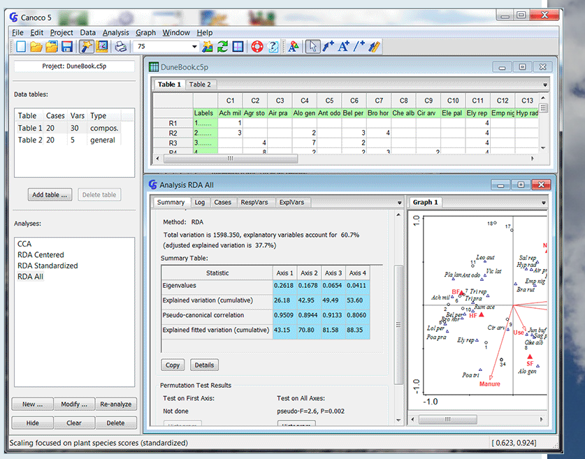

```{r setup, include=FALSE}
knitr::opts_chunk$set(echo = FALSE)
library(vegan)
library(tidyverse)
library(ggplot2)
```

# Putting methods in order
<p style="text-align:center;">

</p>

# CA and CCA
Some of the oldest techniques used by (plant) community ecologists    

::: {.pull-left}  
<p style="text-align:center;">

</p>
<p style = "font-size: 40%;">@ http://www.canoco5.com/ </p>
:::

::: {.pull-right}  
<p style="text-align:center;">

</p>
<p style = "font-size: 40%;">@ https://www.ceh.ac.uk/services/decorana-and-twinspan </p>
:::

# Correspondence analysis (CA)
- A unimodal unconstrained ordination method;     
- The resulting ordination of the distances among sites and species are presented by $\chi^2$ distance, which is not influenced by double zeros.   
- Data: frequencies or frequency-like, i.e. nonnegative. Usually characterised by a long gradient ( > 4SD). In simple words: species counts or presence-absence data.    
- Kaiser-Gutmann criterion and the broken stick model can be used to decide how many axes to retain.    


# Scaling in CA
- __Scaling 1__: The distances among objects in reduced space approximate $\chi^2$ distances in multidimensional space. The objects (sites) that are closer to each other are likely to be more similar in their composition. A species that is close to the object likely contributes strongly to it.      
- __Scaling 2__: The distances among species in reduced space approximate their $\chi^2$ distances in multidimensional space. If a species lies close to the object, it is more likely to be found in that object or to have higher frequency there.   

# Briefly on technical side   
- The variation that is explained is measured by total inertia;     
- To know the proportion of variation explained by each axis we need to divide the eigenvalue of this axis by the total inertia; 
- Produces one correspondence axis fewer than $min(n, p)$;
- Often creates a strong __arch artefact__ that is due to a non-linear correlation between first and higher axes. This arch is due to having some sites that have no species in common (they are very dissimilar). Instead of a linear trend, in an ordination space such a phenomenon is represented by an arch (as if the space of the first axis has to bend to reflect those huge dissimilarities among the sites).     

# Application: Vegetation data
We have plant cover data taken from 24 sites on in total 44 species.   

```{r dat, echo = TRUE}
data(varespec)
str(varespec)
```

# Run CA
```{r CA example, echo = TRUE}
ca_veg <- cca(varespec)
summary(ca_veg)

```

# Decide how many axes to retain
::: {.pull-left}  
Apply broken stick model.  
```{r broken stick example, echo = TRUE}
(bstick_res <- bstick(ca_veg))
(eigval <- ca_veg$CA$eig)
```
:::

::: {.pull-right}
```{r test right plot, fig.align='center', out.height='90%', out.width='90%'}
barplot(t(cbind(eigval, bstick_res)), beside = TRUE, las =  2, col = c('red', 'lightgrey'))

```

:::


# Visualise CA
```{r CA plot, echo = TRUE, fig.align='center', out.height= '70%', out.width='70%'}
par(mfrow = c(1, 2))
plot(ca_veg, scaling = 1)
plot(ca_veg, scaling = 2)
```

# Plot other axes
```{r CA plot2, echo = TRUE, fig.align='center', out.height= '70%', out.width='70%'}
par(mfrow = c(1, 2))
plot(ca_veg, scaling = 2, choices = c(2, 3))
plot(ca_veg, scaling = 2, choices = c(2, 4))
```


# Detrended Correpondence Analysis (DCA)
- To detrend the data axis I is divided into a chosen number of segments, and within each segment the mean of the object scores along axis II is forced to 0.    
- Rarely used nowadays as it is criticised for such a brute-force approach to data.   
- Was used in the past to decide whether to apply unimodal or linear methods, based on the length of the gradient. But is not really needed nowadays as transformation-based and distanced-based approaches were developed.  

# Example of DCA
__Axis lengths__ indicates the gradient length (the one to look at is for the first axis, DCA1).   
```{r DCA ex, echo = TRUE}
DCA_veg <- decorana(varespec)
summary(DCA_veg)
```


# Visualize DCA
```{r plot DCA, echo = TRUE, fig.align='center', out.height= '60%', out.width='60%'}
plot(DCA_veg)
```
Technical detail: in DCA only __scaling 1__ is available, that is the focus on objects rather than species.    


# envfit: post-hoc explanation of ordination axes
- Often misused in that it is used to explain the variation in the species data. It does not do that (there are constrained ordination methods specifically developed for this, CCA and RDA).    
- This function was developed to calculate regression of post-hoc (supplementary) variables on ordination axes of unconstrained ordination.   
- envfit() also tests the significance of this regression (of a variable on ordination axes) by permutation test.     
- If such a supplementary variable is significant, it does not mean they are important for species composition (they may be, but that is not what the test does). The regression finds the best fit to variation extracted by unconstrained ordination into the main ordination axes.    
    

# envfit: example
```{r envFit, echo = TRUE}
data(varechem)
test_Soil <- envfit(ca_veg, varechem$Baresoil)
test_Soil
```
Should rather not be used to avoid confusion.  

# envfit: visualization
```{r envFit plot, echo = TRUE, fig.align='center', out.height= '70%', out.width='70%'}
plot(ca_veg, scaling = 2)
plot(test_Soil)
```


# Canonical Correspondence Analysis
- Was very popular in the past, now rather rarely used (because the methods that can deal with data in a more straightforward way have been developed).    
- It is a constrained ordination method that preserves $\chi^2$ distance.    
- Rare species may have a disproportionate effect on the method (because the difference in abundance for common species contributes less to the $\chi^2$ distance than the same difference for a rare species).   
- Simulation studies show that $\chi^2$ distance perform not the best for community data.      
- No simple method to correct for the proportion of the total explained inertia, no way to calculate adjusted $R^2$.
   
# Application of CCA
Explain plant community composition by soil properties (physical and chemical).     
```{r cca data check, echo=TRUE}
str(varechem)
```

# Fit CCA
```{r cca ex, echo=TRUE}
vare.cca <- cca(varespec, varechem)
vare.cca
```


# Interpret CCA
```{r cca res, echo=TRUE}
summary(vare.cca)
```
<span style= "font-size: 80%;">
- __Partitioning of scaled Chi-square__: Shows the total inertia in the data and its proportion that is explained (constrained) by explanatory variables.   
- __Importance of components__: Eigenvalues for each axis, and the proportion it explains. Pay attention: the total number of canonical axes is $min(n, p) -1$, of which $p$ are constrained canonical axes (CCAs).   
</span>

# Interpret CCA
```{r cca res2, echo=TRUE}
summary(vare.cca)
```

<span style= "font-size: 80%;">
- __Species scores__: coordinates of the arrowheads representing the species.    
- __Site scores__: coordinates of sites (classically shown by points) in the space of the species in matrix $Y$, calculated as weighted means of species scores present at each particular site.</span>


# Interpret CCA
```{r cca res3, echo=TRUE}
summary(vare.cca)
```

<span style= "font-size: 80%;">
- __Site constraints__: Coordinates of the sites in the space of the explanatory variables X. These are fitted values for the site scores.     
- __Biplot scores for constraining variables__: coordinates of the tips of the vectors corresponding to explanatory variables.   
</span>


# Visualize CCA
::: {.pull-left}
```{r cca plot Scle 1, echo=TRUE, fig.align='center', out.height='100%', out.width='100%'}
plot(vare.cca, scaling = 1, main = 'Scaling 1')
```
:::


::: {.pull-right}  
 __Scaling 1: Focus on objects__. Distances among objects and among centroids of qualitative explanatory variables, as well as between centroids and individual objects approximate $\chi^2$ distances. Projecting the object at right angle on a quantitative explanatory variable approximates position of the object along that variable.
:::    


# Visualize CCA
::: {.pull-left}
```{r cca plot Scle 2, echo=TRUE, out.height='100%', out.width='100%'}
plot(vare.cca, scaling = 2, main = 'Scaling 2')
```

:::

::: {.pull-right}
__Scaling 2:  Focus on species__. Projecting a species at a right angle on a quantitative environmental variable gives the optimum for this species along this variable. A species that is closer to the centroid of a qualitative environmental variable is likely to be more frequently found in sites characterised by that variable. Distances among centroids and between centroids and objects do not approximate $\chi^2$ distances.
:::

# Test significance
```{r cca sign, echo=TRUE}
anova.cca(vare.cca, step = 1000)

```

# Significance per axis
```{r cca sign ax, echo = TRUE}
vare.cca.form <- cca(varespec ~., varechem)
anova.cca(vare.cca.form, step = 1000, by = 'axis')
```

# Significance per term
```{r cca sign term, echo = TRUE}
anova.cca(vare.cca.form, step = 1000, by = 'term')
```

# Questions?  


# Check-up
- When is envfit() used?    
- Why CA and CCA are less popular now then 20 years ago?    
   


