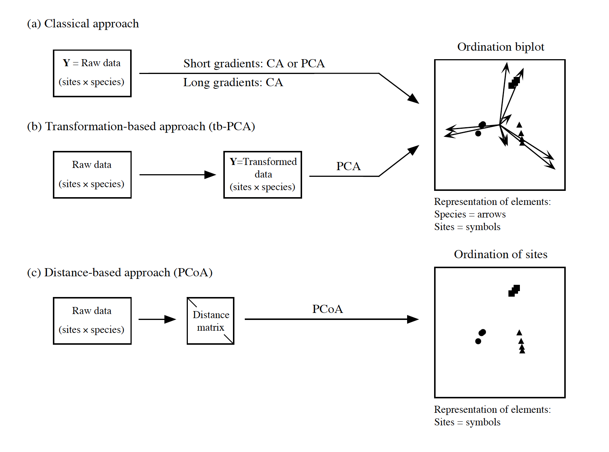
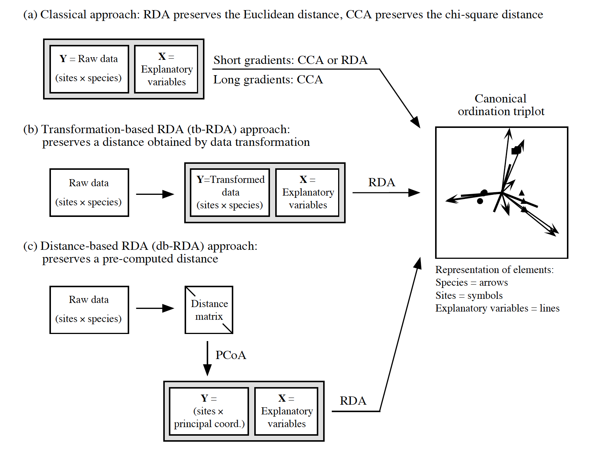

```{r setup, include=FALSE}
knitr::opts_chunk$set(echo = FALSE)
library(vegan)
library(tidyverse)
library(ggplot2)
library(seriation)
```

# Reminder on ways to analyse compositional data
<p style="text-align:center;">

</p>

# Transformation-based & distance-based approaches
<p style="text-align:center;">

</p>
<p style = "font-size: 40%;">@Modified from Legendre & Gallagher 2001</p>
<p style = "font-size: 80%;">One can argue that there is no need to know about CA, CCA and length of the gradient since transformation-based and distance-based approaches are available. </p>

# Principal Coordinate Analysis (PCoA)
- PCoA provides Euclidean representation of the objects, the distances among which are measured by any dissimilarity or distance.      
- PCoA is __unconstrained__ ordination method that is applied to dissimilarity or distance matrix (instead of using raw site by species matrix in PCA, RDA, CA etc).   
- Like PCA and CA, PCoA produces a set of orthogonal axes, and their importance is measured by eigenvalues.    

# Negative eigenvalues
- In case of using distance measure that is not metric, the PCoA may produce axes with negative eigenvalues which cannot be plotted.    
- Ways to deal with this: 
    - __Lingoes correction__ adds a constant to the squared distance among the objects; 
    - __Cailliez correction__ adds a constant to distances directly.  
    - convert non-metric dissimilarity index to a metric one (e.g. Bray-Curtis dissimilarity is not metric, but after square-root transformation becomes metric).   
- Since PCoA is applied to the dissimilarity matrix (calculated for samples, i.e. objects), the species scores are not calculated. But they can be projected on the ordination space by weighted averaging or correlations, similarly as supplementary environmental variables are projected with envfit() function.   

# Dissimilarity metrics
- Jaccard 
- Soerensen   
- Bray-Curtis    
- Chord   
- Hellinger   
- Gower (allows using variables of different data types together)       
- ....

Important: transformation-based approach works with the following transformations: chord, Hellinger, chi-square and Ochiai distances, whereas distance-based approach is appplicable to a much wider range of dissimilarity metrics.    


# Application of PCoA
We again use the plant community data taken in 24 sites.
```{r data, echo = TRUE}
data("varespec")
str(varespec)
```

# Calculate Bray-Curtis dissimilarity
```{r PcoA call BC, echo = TRUE}
brC <- vegdist(varespec, method = 'bray')
brC
class(brC)
```

# How this matrix look like
```{r check matrix, echo=TRUE, out.height='60%', out.width= '60%', fig.align='center'}
dissplot(brC)
```

# Apply PCoA
```{r PcoA on BC, echo = TRUE}
bc_plant <- cmdscale(brC, eig= TRUE)
bc_plant

```
Option `eig = TRUE` also returns eigenvalues.

# Visualize the results
Usually only site scores are returned (as we are working with dissimilarities between the sites)
```{r vis PcoA, echo = TRUE, fig.align='center', out.height='50%', out.width= '50%'}
ordiplot(bc_plant, display = 'sites', type = 'text')
```

# Visualize PCoA, add species
<p style = "font-size: 80%;">We can project species on ordination by showing weighted averages of their contributions to the sites.</p>    
```{r vis PcoA and spe, echo = TRUE, fig.align='center', out.height='60%', out.width= '60%'}
spe.plants <- wascores(x = bc_plant$points, w = varespec)
ordiplot(bc_plant, display = 'sites', type = 'text')
text(spe.plants, labels = rownames(spe.plants), col = 'blue', cex = 0.7)
```


# Once more: now focus on canonical methods
<p style="text-align:center;">

</p>
<p style = "font-size: 40%;">@Modified from Legendre & Gallagher 2001</p>

# Distance-based RDA
- A __constrained__ ordination method that works on the matrices of dissimilarity among the objects (samples, sites).   
- PCoA is computed on a dissimilarity matrix --> all principal coordinate axes are retained.    
- Next, RDA is run by using the produced principal coordinates data as response matrix and the set of given explanatory variables.   

# Application of db-RDA 
```{r dbRDA on BC, echo = TRUE}
data("varechem")
plant.dbRDA <- capscale(varespec ~ N + P + K + Al + S, varechem, dist="bray")
plant.dbRDA
```

# Results
```{r dbRDA res, echo = TRUE}
summary(plant.dbRDA)
```

# Visualize db-RDA
```{r vis dbRDA, echo = TRUE, fig.align='center', out.height='60%', out.width= '60%'}
plot(plant.dbRDA, scaling  = 2)
```

# Test significance
```{r sign dbRDA, echo = TRUE}
anova(plant.dbRDA, step = 1000)
anova(plant.dbRDA, step = 1000, by = 'term')
```

# Apply Lingoes correction
```{r dbRDA corr results, echo = TRUE}
plant.dbRDA_add <- capscale(varespec ~ N + P + K + Al + S, varechem, dist="bray", add = TRUE)
plant.dbRDA_add
```
Option `add = TRUE` adds a constant to the dissimilarities. 

# Results with Lingoes correction
```{r dbRDA correction, echo = TRUE}
summary(plant.dbRDA_add)

```

# db-RDA with Lingoes correction
```{r dbRDA corr plot, echo=TRUE, fig.align='center', out.height= '70%', out.width= '70%'}
plot(plant.dbRDA_add, scaling  = 2)
```

# Significance for db-RDA with correction
```{r sign dbRDA corr, echo= TRUE}
anova(plant.dbRDA_add, step = 1000)
```

# Questions?  


# Check-up
- How comparable is PCA and PCoA based on matrix of Euclidean distances?    
- Are CCA the same as db-RDA using matrix of $\chi^2$ distances among sites?       


