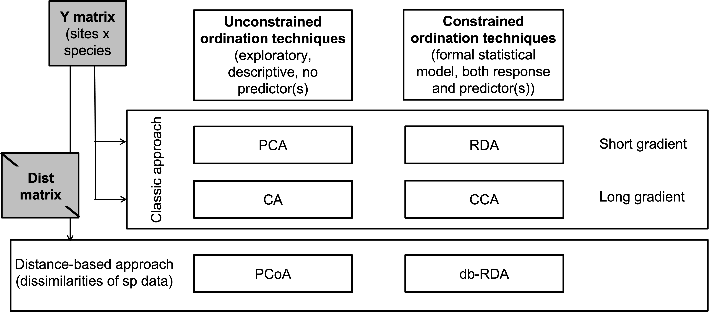
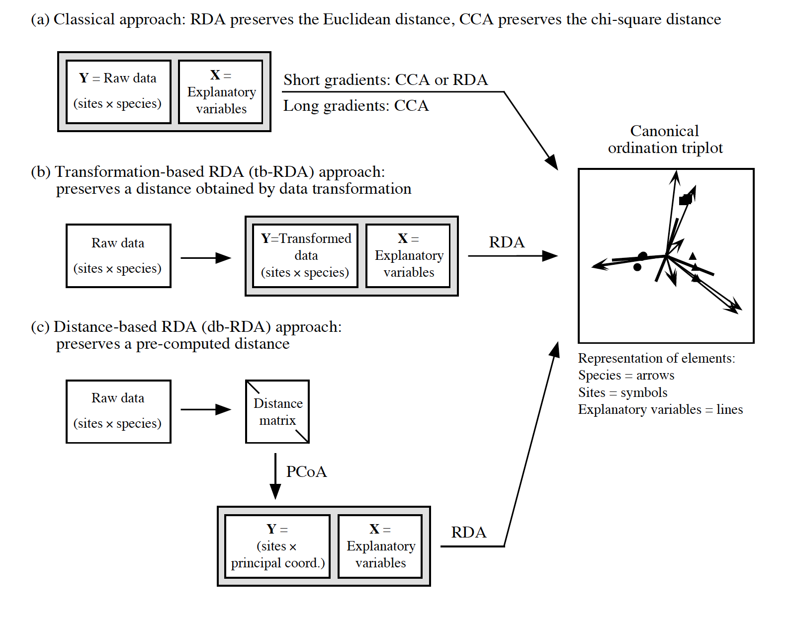
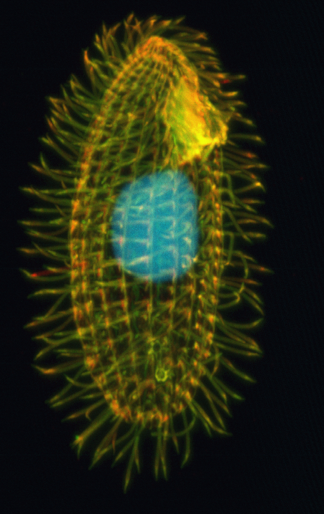
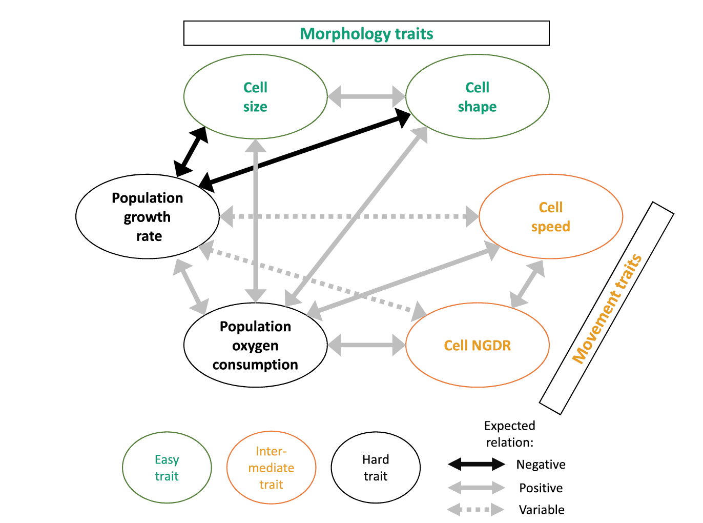
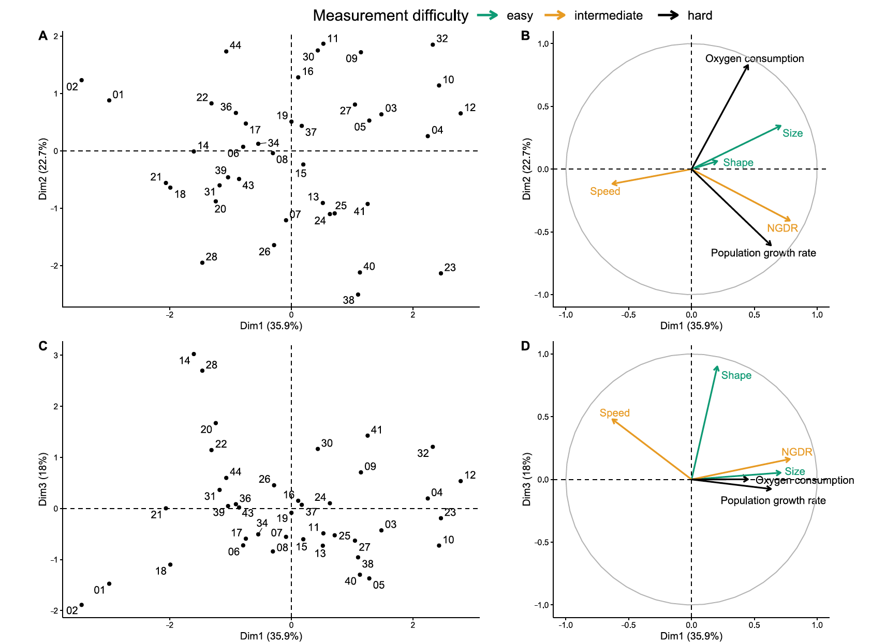
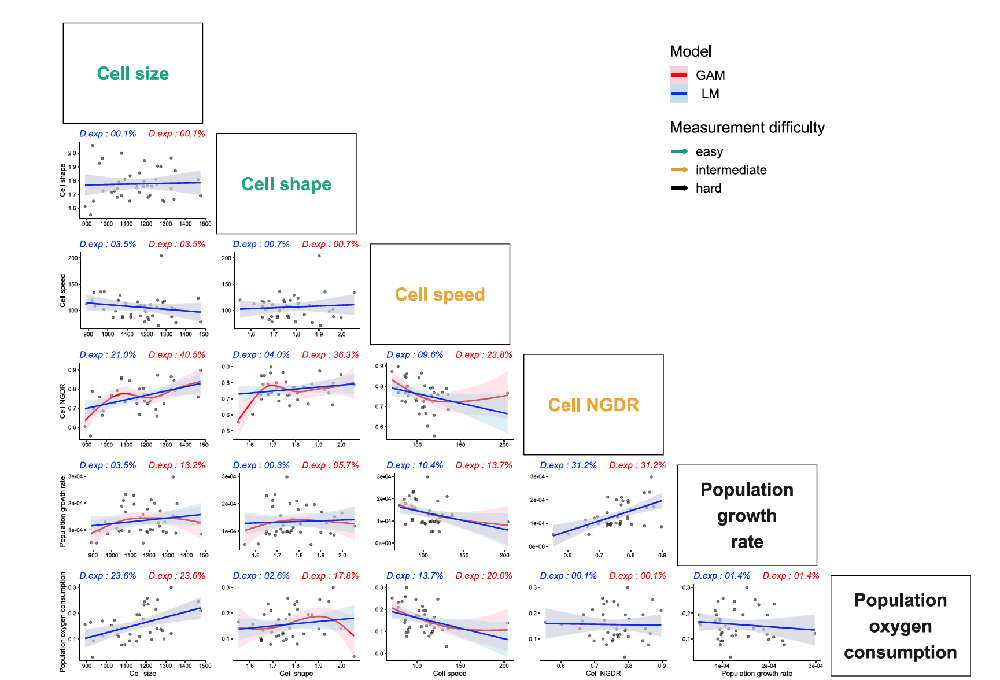

```{r setup, include=FALSE}
knitr::opts_chunk$set(echo = FALSE)
library(vegan)
library(tidyverse)
library(ggplot2)
library(lattice)
```

# Unconstrained and constrained ordination
<p style="text-align:center;">

</p>

# Unconstrained methods
<p style="text-align:center;">

</p>

# Constrained methods
<p style="text-align:center;">

</p>

# Main data requirements 
- Linear relations among the descriptors    
- How often is this the case?    
- How often is this verified?    

# Vegetation data
```{r dat, echo = TRUE}
data(varechem)
str(varechem)

```

# Bivariate exploratory plots
```{r plots, echo = FALSE, fig.align='center'}

plot_func<- function(y = 'N'){
plot(varechem[['N']], varechem[[y]], 
     pch = 19, xaxt = 'n', yaxt = 'n', 
     xlab = '', ylab = '') 
  mtext('N', side = 1, line = 0)
  mtext(y, side = 2, line = 0)
}

par(mfrow = c(3, 5),
    mar = c(1.5, 1.5, 1.5, 1.5))
for(i in 2:(ncol(varechem) + 1)){
plot_func(y = colnames(varechem)[i])
}

```

# Specific focus of methods on communities
- RDA: linear relation between the species abundance (presence/absence) and the environmental factors   
- <span style = 'color:orange'>How often such relations will be linear?</span>   
```{r linear rel sp abundance_Env, echo = FALSE, fig.align='center', out.height= '60%', out.width='60%'}
x <- seq(-20, 20, by = 1)
y <- 2 + 0.5*x
y_opt <- -1.3*x^2
dat <- data.frame(x = x, y = y, y_opt = y_opt)
ggplot(dat, aes(x, y)) + geom_line(lwd = 2) +
  theme_bw() + xlab('Environment') +
  ylab('Species abundance')  +
    theme(axis.title = element_text(size = 20))
```

# Ecological niche
```{r opt rel sp abundance_Env, echo = FALSE, fig.align='center'}
ggplot(dat, aes(x, y_opt)) + geom_line(lwd = 2) +
  theme_bw() + xlab('Environment') +
  ylab('Species abundance') +
  theme(axis.title = element_text(size = 20))
```

# Paradox
Many multivariate methods were developed to deal with community data.     
Linearity is rarely the case in the relation between environment and species abundance (neither according to the theory nor empirical evidence).   
And some methods are based on unimodal responses of species to environments (CA and CCA), whereas the others assume linearity (but distance-based and transformation-based methods deal with the issue of 'double zeros').      


# Case study 
__Complexity vs linearity: relations between functional traits in a heterotrophic protist__    
Svendsen et al. 2023 BMC Ecol & Evol

::: {.pull-left}  

<p style="text-align:left;">

</p>
<p style = "font-size: 80%; text-align:left;">Nils Svendsen</p>
::: 


::: {.pull-right}
<p style="text-align:left;">

</p>
<p style = "font-size: 80%; text-align:left;">Nicolas Schtickzelle</p>
:::

# Functional traits
- "...morphological, biochemical, physiological or behavioral characteristics that are expressed by individuals and considered relevant to 
  - the response of such organisms to the environment: __Response traits__, and/ or
  - their effects on ecosystem properties: __Effect traits__ (Violle et al. 2007 Oikos).     
- How to pick up the right ones?
- How to measure all of the relevant ones?
- Proxies are needed but are they reliable?

# Correlation between functional traits in a ciliate
_Tetrahymena thermophilla_ as a study species: 40 strains with variation in traits.   
<p style="text-align:center;">

</p>
<p style = "font-size: 40%;text-align:center;">@Wikipedia</p>


# Hypothesized relations
<p style="text-align:center;">

</p>
<p style = "font-size: 60%;text-align:center;">@ Fig. 2 from Svendsen et al (2023)</p>

Hodgson et al. (1999) proposed to distinguish soft and hard traits.    
__Hard traits__: directly related to ecosystem functioning but are difficult to measure;   
__Soft traits__: easy to measure but the link with ecosystem fnctioning may be not obvious.   

# PCA on traits
<p style="text-align:center;">

</p>
<p style = "font-size: 60%;text-align:center;">@ Fig. 4 from Svendsen et al (2023)</p>
__Circle of equilibrium contribution__ visualises the importance of single predictors. The predictors that reach circle contribute equally to all PCA axes, descriptors that reach out of the circle radius make a higher contribution than average to the current display (usually 2 axes) and can be interpreted with confidence. 


# Pair-wise relations
<p style="text-align:center;">

</p>
<p style = "font-size: 60%;text-align:center;">@ Fig. 4 from Svendsen et al (2023)</p>

# Linearity is not a rule
- Of the 15 assessed pair-wise relations, 8 were non-linear, as evidenced by a higher deviance explained with GAM compared to that explained with LM.   
- No strong correlations in the multidimensional space among the variables that contributed strongly to the first the Principal Components.   
- The fits of the models were pure with single traits as predictors but even having multiple traits predicting another one would not solve the issue, as demonstrated with low correlations among traits according to PCA.   


# Check-up
- What are then alternatives if we deal with multiple predictors (and multiple response variables)?    
- What have to be kept in mind when using this alternative?   
- What is the advantage (if any?) for using distance-based approaches (PCoA and db-RDA) vs transformation-based approaches (tb-RDA and tb-PCA)?   


